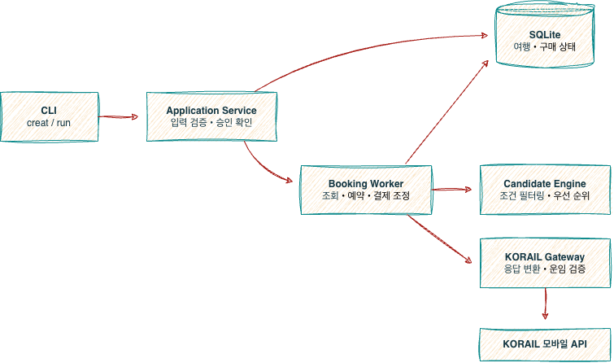

# 코레일 자동 티켓팅

매번 주말/연휴 때 표 다 매진되고, 표 구하겠다고 몇날 몇일 12시까지 대기하다가 결제하는 생활에 빡쳐서 만들어 버린<br>**KORAIL 비공개 모바일 API를 사용한 로컬 CLI 자동 예매 도구**

> [!WARNING]
> 공식 KORAIL API 및 제품 아님 - 비공개 모바일 API 또는 macro error 정책에 따라 미작동 가능성 있음<br>
> KORAIL 계정 필요<br>
> 악용하지 말아주세요ㅠㅠ 정말 필요하신 분만 사용해 주세요

## 주요 기능

- **좌석 조회**: 출발일, 시간대, 열차 종류 지정
- **좌석 자동 재조회**: 지정 시간대에 좌석 없을 시, 설정 간격(예: 2시간)으로 자동 재조회
- **자동 예약**: 좌석 발견 시, 최신 상태 확인 후 예약
- **결제 금액 오류 방지**: 최초 승인한 최대 운임 초과 시, 결제 차단
- **중복 예약 및 결제 방지**: SQLite 트랜잭션을 통해 트레킹
- **결제 오류 방지**: 결제 결과 불명확할 시, 재결재 방지하고 발권 여부부터 확인
- **구매 완료 티켓 확인**: 프로세스 재시작 시, 저장된 예약 및 결제 상태 복구
- **리셀 방지**: 동일 날짜·방향·출발시간 중복 / 같은 방향 노선 전후 2일 이내 중복 금지
- **서버 오류 자동 재시작**: KORAIL 서버 오류 `S002` 발생 시 세션 재연결 후 모니터링 자동 재시작

**현재 제한 사항**:<br>
- 승객 종류 = 성인 (특가 상품 불가) 
- 전 구간 일반 좌석
- 웹 UI와 HTTP API는 제공하지 않음

## 기술 스택

| 분야 | 기술 |
|------|------|
| 언어 및 런타임 | Python 3.11 이상 |
| CLI | `argparse` |
| 데이터베이스 | SQLite (`sqlite3`) |
| 보안 입력 | `getpass` |
| KORAIL 연동 | `korail-mobile-api` — 특정 Git 커밋으로 버전 고정 |
| HTTP 및 암호화 | `httpx`, `cryptography` |
| 테스트 | `unittest` |
| 패키징 | `setuptools`, `pyproject.toml` |

## 빠른 시작

### Docker로 실행

Docker Desktop 또는 Docker Engine과 Compose 실행<br>
소스 폴더 다운시, clone 단계 생략가능

```
git clone https://github.com/JINzinzara/korail-auto-booker.git
cd korail-auto-booker
docker compose run --build --rm booker
```

터미널 질문에 따라 응답 &rarr; 여행 정보 SQLite 저장<br>
*첫 빌드는 의존성 다운로드로 인해 시간이 걸릴 수 있음*

```
출발역: 서울
도착역: 부산
여행 날짜 YYYY-MM-DD: 2026-10-01
출발 시작시각 HH:MM: 08:00
출발 종료시각 HH:MM: 09:00
열차 종류 (여러 개는 쉼표로 구분) [KTX]:
성인 인원 [1]:
trip_id=1 서울 → 부산 2026-10-01 08:00~09:00 성인 1명
총 결제 상한 (원): 70000
이 조건으로 자동 예약·실제 카드 결제를 승인합니까? yes/no [no]: yes
KORAIL 회원번호 또는 로그인 ID: 본인 계정
카드번호: (숨김 입력)
카드 비밀번호 앞 2자리: (숨김 입력)
카드 유효기간 YYMM: (숨김 입력)
생년월일 YYMMDD: (숨김 입력)
코레일 비밀번호: (숨김 입력)
```

승차권 조회 성공 시, `trip_id=... status=TICKETED` 출력하고 종료

### 상태 확인·기존 여행 재개·중지

```
docker compose run --rm booker status
docker compose run --rm booker run 2
docker compose run --rm booker stop 2
```

`2`는 status에 표시된 실제 ID로 변환됨 (ID는 SQLite가 자동 발급).<br>
재개는 같은 DB/volume을 사용<br>
stop은 DRAFT/MONITORING만 중지하며, 예약 취소·환불 명령이 아님.

### Python 실행

macOS/Linux:
```
python3 -m venv .venv
source .venv/bin/activate
python -m pip install .
korail-booker run
```

Windows PowerShell:
```
py -m venv .venv
.venv\Scripts\Activate.ps1
python -m pip install .
korail-booker run
```

```
```bash
korail-booker status
korail-booker run 2
korail-booker stop 2
```

기본 DB = `korail-booker.sqlite3`

### 오류 발생 시
- `S002` 등 일시적 오류: 안내된 시간만큼 대기한 뒤 재접속
- 재접속 횟수 소진: 원래 오류를 출력하고 종료. 기본 5회이며 `KORAIL_MAX_RESTARTS`로 조정 가능
- 로그인 정보 오류·응답 형식 오류: 자동 반복하지 않고 종료
- `CLAIMING`: 예약 결과 확인 필요
- `PAYING/RECONCILING`: 같은 ID를 재개 시, 승차권을 확인하며 자동 재결제하지 않음
- Ctrl+C: 프로세스 종료. 재시작은 status 확인 후 같은 ID 사용. 컨테이너/PC 종료 후 자동 프로세스 재시작은 제공하지 않음

## 폴더 구조

```text
korail-auto-booker/
├── pyproject.toml
├── README.md
├── src/
│   └── korail_booker/
│       ├── __init__.py
│       ├── app.py       # CLI, 환경변수 및 비밀정보 입력
│       ├── domain.py    # 여행·후보·예약·구매 상태 모델
│       ├── engine.py    # 조건에 맞는 최우선 열차 선택
│       ├── korail.py    # KORAIL API 연결과 응답 변환
│       ├── storage.py   # SQLite 상태 저장과 상태 전이
│       └── worker.py    # 조회·예약·결제·발권 확인 흐름
└── tests/
    ├── test_app.py
    ├── test_contract.py
    ├── test_engine.py
    ├── test_korail.py
    └── test_worker.py
```

## 아키텍처



주요 상태 흐름:

```text
DRAFT
  → MONITORING
  → CLAIMING
  → RESERVED
  → PAYING
  → RECONCILING
  → TICKETED
```

> [참고 사항]<br>
> SQLite 트랜잭션과 고유번호 인덱스로 하나의 여행에 대해 하나의 구매 시도만 진행<br>
결제 요청 이후 미응답 시 자동 재결재 하지 않음 &rarr; `RECONCILING`로 상태 저장 후 승차권 목록만 재조회<br>
`CLAIMING` 상태에서 프로세스가 중단된 경우, 자동 재실행하지 않고 수동 확인이 필요

공개 Hugging Face Space나 원격 예약 서비스 형태의 운영은 권장하지 않음<br> 
현재 프로그램은 터미널 숨김 입력과 로컬 SQLite를 전제로 하며, 원격 서비스에 계정·카드정보를 전달하도록 설계되지 않음

## 주의사항

- 본인 계정과 본인 카드만 사용할 것
- 운임 상한을 실제 예상 운임보다 지나치게 높게 설정하지 말 것
- 같은 여행을 여러 프로세스에서 동시에 실행하지 말 것
- KORAIL 모바일 API 변경으로 언제든 작동이 중단될 가능성 다분
- 자동화 사용에 따른 계정, 예약, 결제 관련 책임은 사용자에게 있습니다!!!
